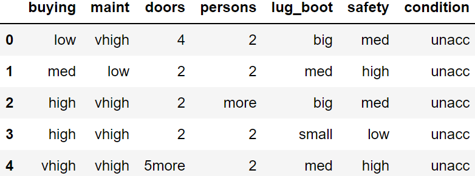

# AdaBoost ("Adaptive Boosting")

## Description

AdaBoost, short for Adaptive Boosting, is a statistical classification meta-algorithm formulated by Yoav Freund and 
Robert Schapire in 1995, who won the 2003 Gödel Prize for their work. It can be used in conjunction with many other 
types of learning algorithms to improve performance. The output of the other learning algorithms ('weak learners') is 
combined into a weighted sum that represents the final output of the boosted classifier. Usually, AdaBoost is presented 
for binary classification, although it can be generalized to multiple classes or bounded intervals on the real line.

AdaBoost is adaptive in the sense that subsequent weak learners are tweaked in favor of those instances misclassified 
by previous classifiers. In some problems, it can be less susceptible to the overfitting problem than other learning 
algorithms. The individual learners can be weak, but as long as the performance of each one is slightly better than 
random guessing, the final model can be proven to converge to a strong learner.

Although AdaBoost is typically used to combine weak base learners (such as decision stumps), it has been shown that it 
can also effectively combine strong base learners (such as deep decision trees), producing an even more accurate model.

Every learning algorithm tends to suit some problem types better than others, and typically has many different 
parameters and configurations to adjust before it achieves optimal performance on a dataset. AdaBoost (with decision 
trees as the weak learners) is often referred to as the best out-of-the-box classifier. When used with decision tree 
learning, information gathered at each stage of the AdaBoost algorithm about the relative 'hardness' of each training 
sample is fed into the tree growing algorithm, such that later trees tend to focus on harder-to-classify examples. 
(Wikipedia: [AdaBoost](https://en.wikipedia.org/wiki/AdaBoost))

## Boosting

- **Analogy:** 
  - Consult several doctors, based on a combination of weighted diagnoses – weight assigned based on the previous 
  diagnosis accuracy.
- **How boosting works:**
  - Weights are assigned to each training tuple.
  - A series of _k_ classifiers is iteratively learned.
  - After a classifier _Mi_ is learned, the weights are updated to allow the subsequent classifier, 
  _Mi+1_ to pay more attention to the training tuples that were misclassified by _Mi_.
  - The final _M*_ combines the votes of each individual classifier, where the weight of each classifier’s 
  vote is a function of its accuracy.
- **Classification:**
  - Each classifier _Mi_ returns its class prediction.
  - The bagged classifier _M*_ counts the votes and assigns the class with the most votes to X.
- **Boosting algorithm can be extended for numeric prediction.**

## AdaBoost.M1 Algorithm (From the original paper By Yoav Freund, Robert E Schapire)

<picture>
  <source media="(prefers-color-scheme: dark)" srcset="assets/Algorithm-dark.png" width="615" height="695">
  
</picture>

## Simplified interpretation
### Training:
- Given a data set _D_ of _d_ class-labeled tuples: (x1, y1), ... ,(xd, yd)   
with yd ∈ Y = {1, ... ,c}.  
- Initialize empty lists to hold information per classifier: **w**, **β**, **M** ← empty list.  
- Initialize weights for first classifier to hold same probability for each tuple: wj1 ← $\LARGE \frac{1}{d}$
- Generate _K_ classifiers in _K_ iterations. At iteration k,  
  1. Calculate “normalized” weights:
     
$\LARGE \textbf{p}^k = \frac{\textbf{w}^k}{Σ_{j=1}^d w_j^i}$

  2. Sample dataset with replacement according to **p**k to form training set _Dk_.  
  3. Derive classification model _Mk_ from _Dk_.  
  4. Calculate error _εk_ by using _Dk_ as a test set as follows: 
     
$\LARGE ε_k = Σ_{j=1}^d p_j^k \cdot \text{err}(M_k, x_j, y_j)$,
 
     where the misclassification error $\text{err}(M_k, x_j, y_j)$ returns 1 if Mk(xj) $\neq$ yj, otherwise it returns 0.  
  5. If $\text{error}(M_k)$ > 0.5: Abandon this classifier and go back to step 1.  
  6. Calculate 
     
$\LARGE \textbf{β}_k = \frac{ε_k}{1 - ε_k}$.

  7. Update weights for the next iteration: 
     
$\LARGE  w_j^{k+1} = w_j^kβ_k^{1−\text{err}(M_k, x_j, y_j)}$.

     If a tuple is misclassified, its weight remains the same, otherwise it is decreased. Misclassified tuple weights are increased  relatively.  
  8. Add **w**k+1 , _Mk_ , and _βk_ to their respective lists.  

## Dataset
    dataset = pd.read_csv("dataset/car_train.csv")
    dataset.head()
 
  

This dataset is a slightly modified version of the [car evaluation dataset](https://archive.ics.uci.edu/ml/datasets/Car+Evaluation) 
from the UCI Machine Learning Repository. Originally, this dataset has four class values. For the sake of this example 
dataset modified to binary classification. 

## AdaBoost License

Yoav Freund, Robert E Schapire,  
A Decision-Theoretic Generalization of On-Line Learning and an Application to Boosting,  
Journal of Computer and System Sciences,  
Volume 55, Issue 1,  
1997,  
Pages 119-139,  
ISSN 0022-0000,  
https://doi.org/10.1006/jcss.1997.1504.  
(https://www.sciencedirect.com/science/article/pii/S002200009791504X) 
Abstract: In the first part of the paper we consider the problem of dynamically apportioning resources among a set of options in a worst-case on-line framework. The model we study can be interpreted as a broad, abstract extension of the well-studied on-line prediction model to a general decision-theoretic setting. We show that the multiplicative weight-update Littlestone–Warmuth rule can be adapted to this model, yielding bounds that are slightly weaker in some cases, but applicable to a considerably more general class of learning problems. We show how the resulting learning algorithm can be applied to a variety of problems, including gambling, multiple-outcome prediction, repeated games, and prediction of points in Rn. In the second part of the paper we apply the multiplicative weight-update technique to derive a new boosting algorithm. This boosting algorithm does not require any prior knowledge about the performance of the weak learning algorithm. We also study generalizations of the new boosting algorithm to the problem of learning functions whose range, rather than being binary, is an arbitrary finite set or a bounded segment of the real line.  
