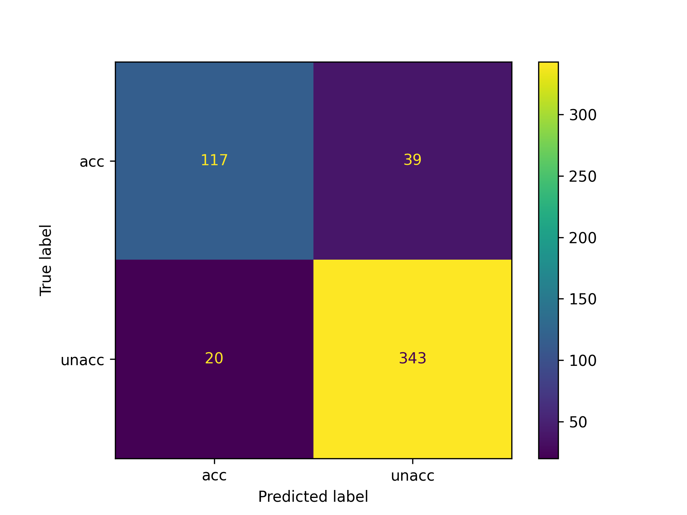
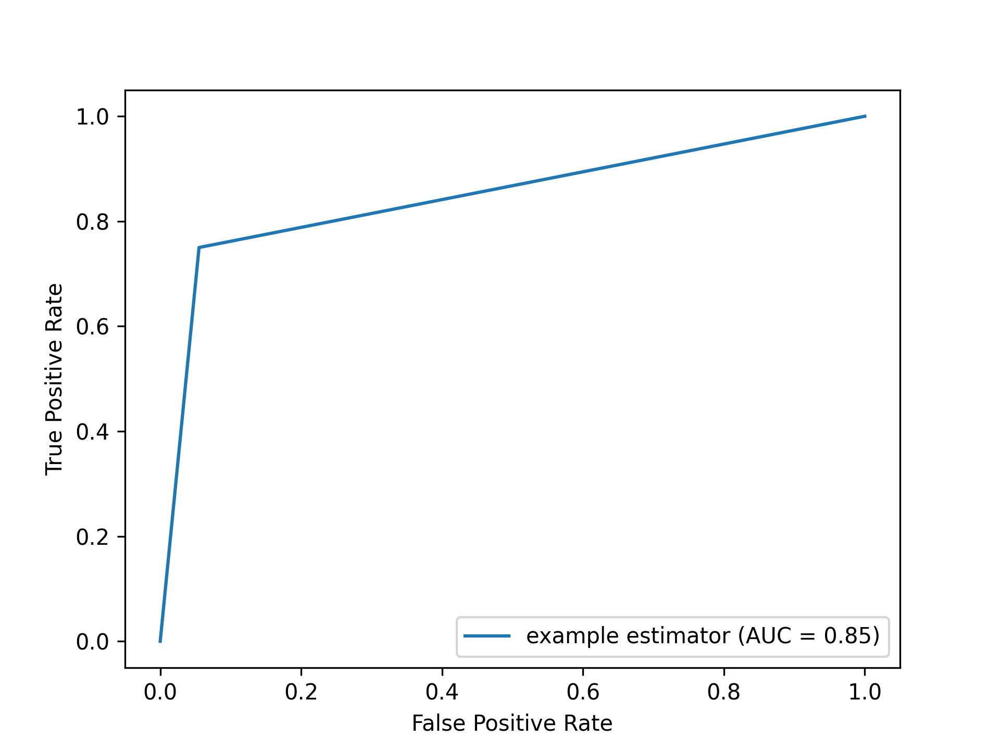

# AdaBoost ("Adaptive Boosting" 1)

## Description

The goal of the algorithm is to find a final hypothesis with low error relative to a given distribution _D_ over the
training examples.   
&emsp;<small>_from the original paper By Yoav Freund, Robert E Schapire_ 1</small>

## Boosting

- **Analogy:**
    - Consult several doctors, based on a combination of weighted diagnoses – weight assigned based on the previous
      diagnosis accuracy.
- **How boosting works:**
    - Weights are assigned to each training tuple.
    - A series of _k_ classifiers is iteratively learned.
    - After a classifier _Mi_ is learned, the weights are updated to allow the subsequent classifier,
      _Mi+1_ to pay more attention to the training tuples that were misclassified by _Mi_.
    - The final _M*_ combines the votes of each individual classifier, where the weight of each classifier’s
      vote is a function of its accuracy.
- **Classification:**
    - Each classifier _Mi_ returns its class prediction.
    - The bagged classifier _M*_ counts the votes and assigns the class with the most votes to X.
- **Boosting algorithm can be extended for numeric prediction.**

## AdaBoost.M1 Algorithm
&emsp;<small>_from the original paper By Yoav Freund, Robert E Schapire_ 1</small>  

&emsp;_reload page if the color scheme doesn't match your theme_

<picture>
  <source media="(prefers-color-scheme: dark)" srcset="assets/Algorithm-dark.png" width="615" height="695">
  
</picture>

## Simplified Step by Step Interpretation

### Training:

- Given a data set _D_ of _d_ class-labeled tuples: (x1, y1), ... ,(xd, y
  d)   
  with yd ∈ Y = {1, ... ,c}.
- Initialize empty lists to hold information per classifier: **w**, **β**, **M** ← empty list.
- Initialize weights for first classifier to hold same probability for each tuple: wj1 ← $\LARGE
  \frac{1}{d}$
- Generate _K_ classifiers in _K_ iterations. At iteration k,
    1. Calculate “normalized” weights:
       
$\LARGE \textbf{p}^k = \frac{\textbf{w}^k}{Σ_{j=1}^d w_j^i}$

    2. Sample dataset with replacement according to **p**k to form training set _Dk_.
    3. Derive classification model _Mk_ from _Dk_.
    4. Calculate error _εk_ by using _Dk_ as a test set as follows:
       
$\LARGE ε_k = Σ_{j=1}^d p_j^k \cdot \text{err}(M_k, x_j, y_j)$,
 
       where the misclassification error $\text{err}(M_k, x_j, y_j)$ returns 1 if Mk(xj) $\neq$ yj, otherwise it returns 0.  
    5. If $\text{error}(M_k)$ > 0.5: Abandon this classifier and go back to step 1.
    6. Calculate
       
$\LARGE \textbf{β}_k = \frac{ε_k}{1 - ε_k}$.

    7. Update weights for the next iteration:
       
$\LARGE  w_j^{k+1} = w_j^kβ_k^{1−\text{err}(M_k, x_j, y_j)}$.

       If a tuple is misclassified, its weight remains the same, otherwise it is decreased. Misclassified tuple weights are increased  relatively.  
    8. Add **w**k+1 , _Mk_ , and _βk_ to their respective lists.

_See the implementation of the Training part in the `fit` function. You can [view it in adaboost.py](adaboost.py)_

### Prediction:

- **Initialize weight of each class to zero.**
- **For each classifier** _i_ **in** _k_ **classifiers:**
    1. Calculate the weight of this classifier’s vote:
       
$\LARGE  w_i = \log (\frac{1}{β_i})$.

    2. Get class prediction _c_ for (single) tuple _x_ from current weak classifier $M_i: \quad c = M_i(x)$.
    3. Add _wi_ to weight for class _c_.
- **Return predicted class with the largest weight.**
- Mathematically, this can be formulated as:
     
$\LARGE  M(x) = \text{argmax}_{y∈Y} Σ_{i=1}^k (\log (\frac{1}{β_i}))M_i(x)$.

_See the implementation of the Prediction part in the `predict` function. You can [view it in adaboost.py](adaboost.py)_

## Dataset

    dataset = pd.read_csv("dataset/car_train.csv")
    dataset.head()

 
  

This dataset is a slightly modified version of
the [car evaluation dataset](https://archive.ics.uci.edu/ml/datasets/Car+Evaluation)
from the UCI Machine Learning Repository. Originally, this dataset has four class values. For the sake of this example
dataset modified to binary classification. 

## Output Metrics

| Metric                     | Value |
|----------------------------|-------|
| Accuracy                   | 0.89  |
| Recall                     | 0.75  |
| Specificity                | 0.94  |
| Area Under the Curve (AUC) | 0.85  |
| F1 score                   | 0.80  |

 

Confusion Matrix:  

  

Receiver Operating Characteristic (ROC) curve:  

  

_Values may differ in each run_  
_See implementation and more metrics calculation in [main.py](main.py)_

## Bibliography

### 1 A Decision-Theoretic Generalization of On-Line Learning and an Application to Boosting  &emsp;<small>_Under an Elsevier [user license](http://www.elsevier.com/open-access/userlicense/1.0/)_</small>

Yoav Freund, Robert E Schapire,  
A Decision-Theoretic Generalization of On-Line Learning and an Application to Boosting,  
Journal of Computer and System Sciences,  
Volume 55, Issue 1,  
1997,  
Pages 119-139,  
ISSN 0022-0000,  
https://doi.org/10.1006/jcss.1997.1504.  
(https://www.sciencedirect.com/science/article/pii/S002200009791504X) 

### References

Code and Theory constitutes a component of the "Knowledge Discovery in Databases" course [exercise](https://github.com/FAU-CS6/KDD/tree/main/exercise/4-Classification-AdaBoost) offered by
Friedrich-Alexander-Universität Erlangen-Nürnberg  
&emsp;<small>_Under GNU General Public License v3.0_</small>
